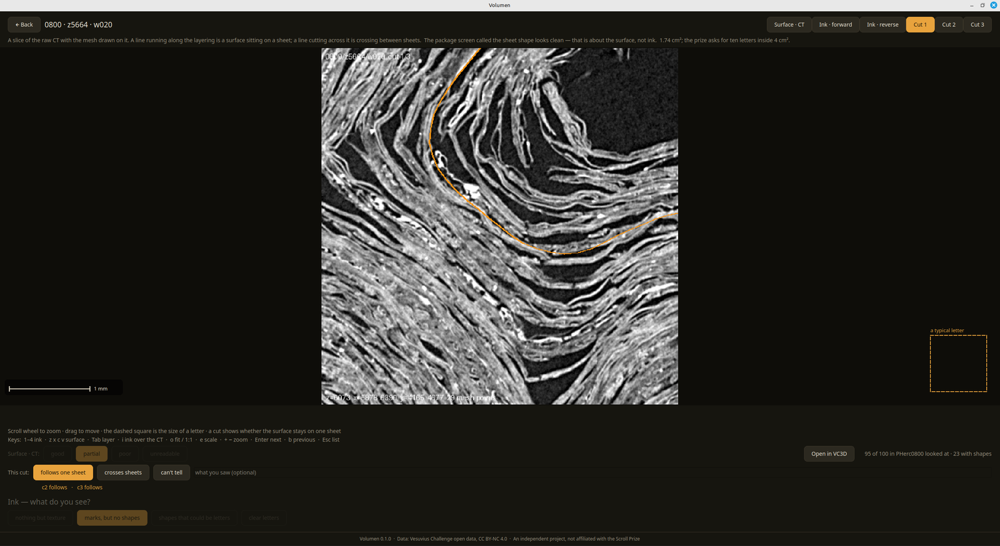

# Volumen

The whole loop, in one place, for the Herculaneum scrolls open to the
[First Letters prize][prize]: open the published surfaces or make new ones,
check that each stays on a single sheet, look for writing, and keep a record of
every judgement.



*A cut through the raw CT of a published surface (PHerc0800): the amber line is
the surface, and where it bends, the sheets around it bend with it, so it stays
on one sheet. Below it, the three judgements: surface, cuts, ink.*

It opens with 340 surfaces from eight eligible scrolls ready to read
([vesuvius-eligible-meshes][meshes]), fetched over the network as you open
them. Surfaces you make with the pipeline, or grow in [VC3D][vc3d], join them
in the same lists.

## Three minutes of it

https://github.com/user-attachments/assets/23603438-330d-4775-bc55-496a5e2e3e79

## Run it

Install [uv][uv] once, then:

```
git clone https://github.com/pscamillo/volumen
cd volumen
uv run app.py
```

On Windows, double-click `volumen.bat`. On Linux, `./volumen.sh`, or
`./install-desktop.sh` for a menu entry. The first run fetches Python and the
dependencies into a local `.venv`: nothing needs to be installed beforehand.
On a minimal Linux system, add `libxcb-cursor0 libxkbcommon-x11-0 libgl1`
(Debian/Ubuntu names); a normal desktop install already has them.

## What it does

- **Scrolls**: one card per scroll eligible on 26 Sep 2026, saying what exists for it, plus
  PHerc Paris 4, already read, to calibrate the eye.
- **Surface view**: the flattened CT, made here from the scan without VC3D; the
  ink maps in both directions; three cuts through the raw CT with the surface
  drawn on them; a 1 mm bar and a letter-sized box for scale.
- **Judging**, in order: does the surface show papyrus weave, does each cut stay
  on one sheet, what does the ink show. Verdicts stay on your machine.
- **Make surfaces**: the team's minimal route, window by window, installed and
  prepared per scroll from inside the app.
- **Fibre gate and Progress**: new surfaces checked against a scroll that has
  been read, and a map of where the work on each scroll stands.

*How this works*, inside the app, goes through each step with the cases it was
learned from.

## Where it runs

| | reading, cuts, judging | making surfaces |
|---|---|---|
| Linux | tested | tested (NVIDIA GPU) |
| Windows 10 / 11 | tested | inside WSL2: expected to work, not yet tested |
| macOS | expected to work, not yet tested | no |

`uv run python tools/bench_read.py` measures how fast this machine reads the
scans. On the machines tested it gives 45 to 50 MB/s on Linux and Windows
alike, which puts a package surface at about half a minute and a cut at a few
seconds.

<details>
<summary><b>How to judge a surface</b></summary>

Look at the flattened CT first, not the ink.

**Surface.** Can you follow fibres across it, horizontals crossing verticals?

**Sheet.** Make the cuts. The amber line should run along one grey layer and
bend with it. A V across a straight stack, or a slide from one layer to the
next, means the surface crossed to a neighbouring sheet, and ink there may
belong to that sheet.

**Ink**, last, and only on surfaces that passed: zoom until the dashed square is
large, and look for organisation (marks in rows, at regular spacing,
letter-sized), not for sharp strokes. Most maps at 9 µm show nothing, and
*nothing but texture* is a real answer: a surface judged sound with nothing on
it is one you will not open again.

</details>

<details>
<summary><b>How the flattened view is made without VC3D</b></summary>

The published surfaces are tifxyz grids (x, y, z per grid point, one point per
20 voxels). `core.gera_mid` samples the CT along the grid exactly the way
`vc_render_tifxyz` does, with the rules read from the VC3D source rather than
guessed:

- output pixel *i* samples the grid at (*i* + 0.5) / step, bilinear with a
  replicated border;
- a pixel needs the four corners of its bilinear cell valid (the renderer turns
  the −1 sentinel into NaN before sampling), and its nearest grid point needs
  its ±1 neighbours (the normal is a central difference);
- values are truncated to uint8, not rounded.

Measured against `vc_render_tifxyz` on PHerc0800 z14672 w020: identical mask, no
pixel off by more than one level, 99.8 % identical. The CT is read over plain
https from the public bucket, in parallel, in slices so the window stays
responsive.

</details>

<details>
<summary><b>Making surfaces: what the pipeline does and what it needs</b></summary>

*Make surfaces* runs the team's **minimal route**: the spiral fitter and
flattener from [villa][villa], the render from VC3D, the
[ink model][ink], wrapped in the author's scripts that go window by window: fit
a spiral to the sheet material, flatten one winding at a time, render the CT
along each surface, run the ink model in both directions, and file the results
where the rest of the app reads them. This is the chain behind the published
package. It follows the sheets through the team's published sheet-direction
volumes ("lasagna"), so it runs on the scrolls that have them; for the others,
grow patches in VC3D and point **Folders** at the `.volpkg`.

It needs, on Linux (or inside WSL2 on Windows, not yet tested):

| what | why | size |
|---|---|---|
| NVIDIA GPU, driver with CUDA ≥ 12.8 | the fitter runs on Triton + CUDA (torch cu128) | 12 GB VRAM tested; 6 GB reported as very tight |
| RAM | the fitter and the render | 32 GB comfortable; 16 GB tight |
| the villa checkout at a pinned commit, with its spiral environment | `fit_spiral.py` | ~10 GB |
| `vc_render_tifxyz` from a VC3D release | the full multi-layer render the ink model reads | ~125 MB |
| the ink-detection package and the ink_9um checkpoint | the ink model | a few GB |
| per scroll: tracks, an umbilicus, a render template | the fitter's inputs | 5–13 GB per scroll |

To set it up, open *Make surfaces* and click **Set up the pipeline…**. It
checks the machine first (system, GPU and driver, VRAM, RAM, disk, git and uv,
network), stops at the first check that fails, shows what it would download and
where, and installs only after you say yes: about 20 GB, resumable if
interrupted. Then **Prepare another scroll…** fetches each scroll's inputs
(tracks, an umbilicus computed from the CT, a render template) and shows the
axis on three slices to accept or replace. The same steps run from a terminal:

```
uv run setup_pipeline.py check
uv run setup_pipeline.py install ~/volumen-pipeline
uv run setup_pipeline.py scroll ~/volumen-pipeline 0125
```

The install folder must have no spaces in its path.

</details>

<details>
<summary><b>Where things live on your machine</b></summary>

`~` is your home folder (`C:\Users\<you>` on Windows).

| what | where |
|---|---|
| your verdicts | `~/.local/share/volumen/my-findings.jsonl` |
| your cut labels | `~/.local/share/volumen/cut_labels.jsonl` |
| the folders you pointed at | `~/.config/volumen/folders.json` |
| flattened views, cuts, downloaded meshes and ink maps | `~/.cache/volumen/` |
| exports for VC3D | `~/Volumen exports/` |

The cache can be deleted at any time; it is rebuilt on demand. The two files in
`~/.local/share/volumen/` hold what cannot be made again.

</details>

<details>
<summary><b>Development</b></summary>

Plain PySide6, one module per screen: `app.py` (shell and style),
`surfaces.py`, `explore.py`, `build.py`, `gate.py`, `progress.py`,
`folders.py`, `help.py`. `core.py` holds the scroll table, volume access and
the flattener; `sources.py` the surface sources (package, local folders,
pipeline output, VC3D volpkg); `cuts.py` / `cortes.py` the cuts; `flat.py` the
background worker; `config.py` the data locations; `export_vc3d.py` the
*Open in VC3D* export; `setup_pipeline.py` and `setup_page.py` the installer;
`pipeline/` the scripts it installs; `tools/bench_read.py` the read-speed test.

Changes take effect on the next start.

</details>

## Data and credits

By Paulo Sergio Camillo (pscamillo), with Claude. The surfaces come from the [vesuvius-eligible-meshes][meshes] package.
The scans, lasagna, tracks, ink model, VC3D and the minimal route with its
spiral fitter are the Vesuvius Challenge team's open data and code (CC BY-NC
4.0), in [villa][villa]; the fitter runs here from the fork of Iyán Dopico
(IyanDopico), which carries his fix. Built on PySide6 (Qt), zarr and numpy. An independent project, not
affiliated with the Scroll Prize. Code: MIT.

[prize]: https://scrollprize.org/prizes
[meshes]: https://github.com/pscamillo/vesuvius-eligible-meshes
[vc3d]: https://github.com/ScrollPrize/villa/tree/main/volume-cartographer
[villa]: https://github.com/ScrollPrize/villa
[ink]: https://github.com/ScrollPrize/villa/tree/main/ink-detection
[uv]: https://docs.astral.sh/uv/
